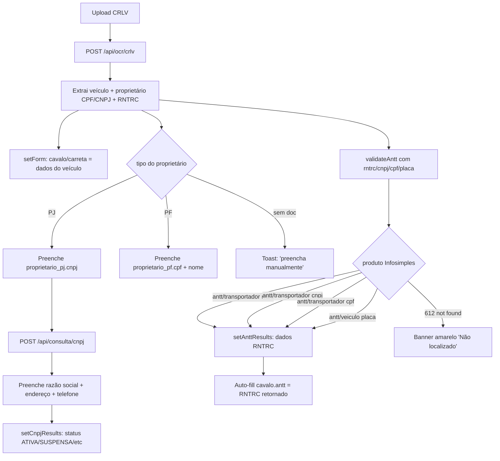
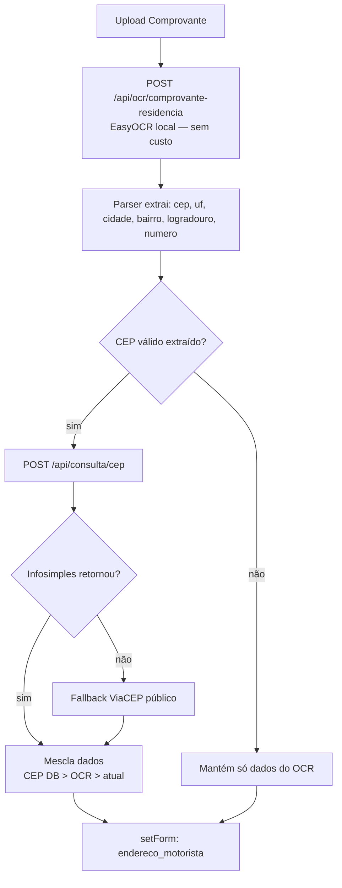
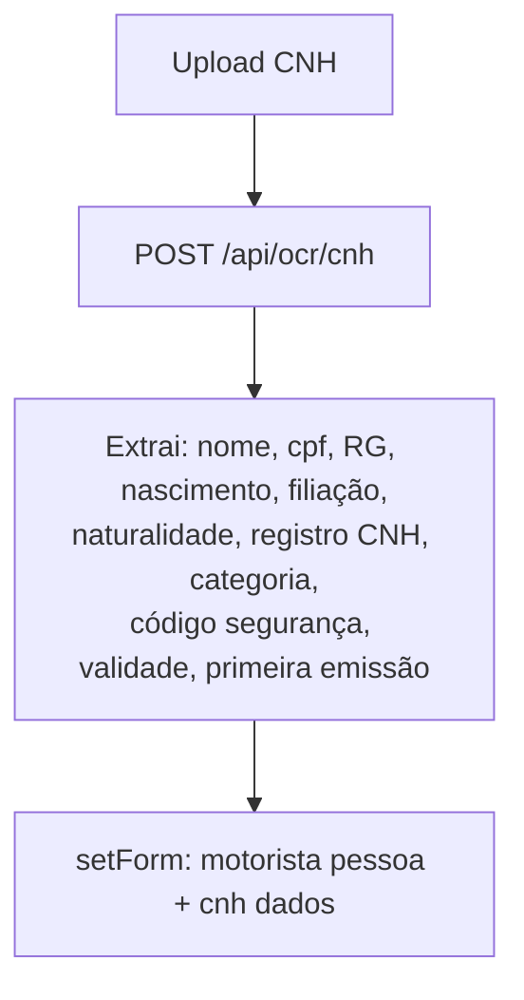
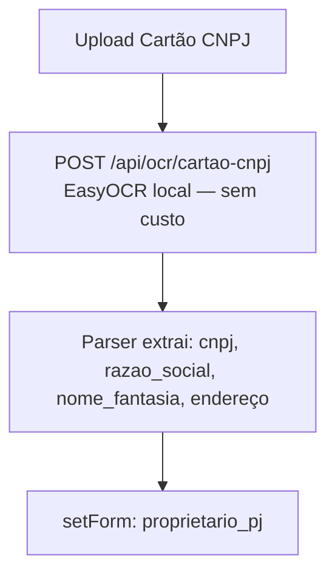

# Cadastro de Motorista PJ — Especificação Técnica

> **Rota:** `/cadastro` · **Tela:** [`frontend/src/pages/CadastroDocumentos.tsx`](frontend/src/pages/CadastroDocumentos.tsx) · **Cliente API:** [`frontend/src/lib/cadastroApi.ts`](frontend/src/lib/cadastroApi.ts) · **Validators:** [`frontend/src/lib/validators.ts`](frontend/src/lib/validators.ts)

---

## 1. Arquitetura

```
┌─────────────────────────┐         ┌──────────────────────────┐         ┌─────────────────────────┐
│  Frontend (Vite :8080)  │ ──────► │  API FastAPI (:8765)     │ ──────► │  Infosimples API        │
│  React + TypeScript     │         │  Python 3.13 + uvicorn   │         │  api.infosimples.com    │
│                         │         │  + EasyOCR local         │         │                         │
└─────────────────────────┘         └──────────────────────────┘         └─────────────────────────┘
                                              │
                                              └──► ViaCEP fallback (público)
                                                   viacep.com.br/ws/{cep}/json
```

- **Vite proxy:** `/ocr-api/*` → `http://localhost:8765/*` (definido em [`vite.config.ts`](frontend/vite.config.ts) — evita CORS).
- **Token Infosimples:** lido do `.env` da API Python (`INFOSIMPLES_TOKEN`).
- **OCR Provider:** `OCR_COMPROVANTE_PROVIDER=local` e `OCR_CARTAO_CNPJ_PROVIDER=local` (usa EasyOCR offline). CNH e CRLV usam Infosimples (alta precisão para esses layouts).
- **Limite de upload:** 10 MB base64 (`MAX_IMAGE_BASE64_BYTES` em `backend/config.py`). Frontend comprime imagens >1.4 MB automaticamente (max 1200 px, JPEG progressivo).

---

## 2. Estrutura do formulário

5 abas em ordem com **progressive unlock** (cada aba só desbloqueia após a anterior estar completa):

| # | Aba | Tab ID | Ícone | Campos principais |
|---|---|---|---|---|
| 1 | **Motorista** | `motorista` | User | Identificação + dados pessoais + telefones + CNH (com upload) |
| 2 | **Endereço** | `endereco` | MapPin | Endereço motorista + comprovante residência (upload) |
| 3 | **Cavalo** | `cavalo` | Truck | Veículo trator + CRLV (upload) + status ANTT |
| 4 | **Carreta** | `carreta` | Truck | Semi-reboque + CRLV (upload) + checkbox "proprietário diferente" |
| 5 | **Proprietário** | `proprietario` | Users | (Condicional) Proprietário PJ ou PF do cavalo + carreta + uploads |

### 2.1 Critério de "completa" (`isComplete`)

Cada tab implementa uma função pura `(form, propTipo, propCarretaTipo) → boolean`:

| Tab | Considerada completa quando |
|---|---|
| Motorista | `nome + cpf + data_nascimento + rg + nome_mae` preenchidos + ≥1 telefone + CNH (registro/categoria/UF/validade) + arquivo `cnh` anexado |
| Endereço | `cep + uf + cidade + bairro + logradouro + numero` preenchidos + arquivo `comprovante_motorista` anexado |
| Cavalo | Veículo (placa, tipo, marca, modelo, anos, cor, renavam, chassi) + arquivo `crlv_cavalo` |
| Carreta | Mesmo critério do cavalo (sempre obrigatório) |
| Proprietário | Combinatorial: <br>• Se motorista é proprietário **e** carreta não é diferente → completa<br>• Senão valida cada bloco PJ/PF aplicável + uploads associados |

### 2.2 Progressive unlock

Tab N é **desbloqueada** se `tab[i].isComplete()` for verdadeiro para todo `i < N`.

- **Click numa tab bloqueada:** `tryChangeTab` intercepta → toast vermelho *"Aba bloqueada"*.
- **Voltar (tab índice ≤ atual):** sempre permitido (revisão).
- **Botão "Próximo":** desabilitado quando `currentTabComplete === false`.

---

## 3. Endpoints da API e onde são consumidos

> Todos via proxy `/ocr-api` que reescreve para `http://localhost:8765`. Headers: `Content-Type: application/json`.

### 3.1 OCR — POST `/api/ocr/cnh`

**Produto Infosimples:** `ocr/cnh` (~R$ 0,30/doc)

**Payload:**
```json
{ "imagem": "<base64>" }
```

**Resposta (resumida):**
```json
{
  "code": 200,
  "data": [
    { "campos": {
        "nome": { "valor": "..." },
        "cpf": { "valor": "..." },
        "registro": { "valor": "..." },
        "categoria": { "valor": "..." },
        "validade": { "valor": "..." },
        "primeira_habilitacao": { "valor": "..." },
        "filiacao": { "valor": "..." },
        "rg": { "valor": "..." },
        "naturalidade": { "valor": "..." },
        "uf_expedicao": { "valor": "..." }
    }}
  ]
}
```

**Cliente:** `ocrCnh(file)` em `cadastroApi.ts` — extrai e estrutura em `{ pessoal, cnh }`.

**Onde é chamado (3 pontos no formulário):**
| Upload | Handler | Preenche |
|---|---|---|
| `arquivos.cnh` (aba Motorista) | `handleCnhMotoristaFile` | `motorista` (pessoa) + `cnh` (dados CNH) |
| `arquivos.cnh_proprietario` (aba Proprietário, bloco PF cavalo) | `handleCnhProprietarioFile` | `proprietario_pf` + `cnh_proprietario_pf` |
| `arquivos.cnh_proprietario_carreta` (Proprietário, bloco PF carreta) | `handleCnhProprietarioCarretaFile` | `proprietario_pf_carreta` + `cnh_proprietario_pf_carreta` |

---

### 3.2 OCR — POST `/api/ocr/crlv`

**Produto Infosimples:** `ocr/crlv` (~R$ 0,30/doc)

**Payload:** `{ "imagem": "<base64>" }`

**Resposta — campos extraídos:** placa, especie, marca_modelo, ano_fabricacao, ano_modelo, cor, chassi, renavam, eixos, municipio, uf, **cpf/cnpj_proprietario**, nome_proprietario, rntrc (se categoria=ALUGUEL), ano_licenciamento.

**Cliente:** `ocrCrlv(file)` em `cadastroApi.ts` — retorna `{ veiculo, proprietario: {documento, tipo, nome} }`. Auto-detecta PJ/PF pelo número de dígitos do documento (14=PJ, 11=PF).

**Onde é chamado:**
| Upload | Handler | Preenche |
|---|---|---|
| `arquivos.crlv_cavalo` (aba Cavalo) | `handleCrlvFile(file, "cavalo")` | `cavalo` + cascata (ver §4.1) |
| `arquivos.crlv_carreta` (aba Carreta) | `handleCrlvFile(file, "carreta")` | `carreta` + cascata |

---

### 3.3 OCR — POST `/api/ocr/comprovante-residencia`

**Produto:** EasyOCR local (texto bruto + parser regex). Não chama Infosimples.

**Payload:**
```json
{ "imagem": "<base64>", "concessionaria": "neoenergia" }
```

> O campo `concessionaria` é **ignorado** quando `OCR_COMPROVANTE_PROVIDER=local`. Mantido por compatibilidade do schema Pydantic.

**Resposta:** texto cru + parser que tenta identificar `cep, uf, cidade, bairro, logradouro, numero`.

**Cliente:** `ocrComprovante(file, concessionaria)` em `cadastroApi.ts`.

**Onde é chamado:**
| Upload | Handler | Preenche |
|---|---|---|
| `arquivos.comprovante_motorista` (aba Endereço) | `handleComprovanteMotoristaFile` | `endereco_motorista` (cascata com CEP — ver §4.2) |
| `arquivos.comprovante_proprietario` (Proprietário, bloco PJ ou PF cavalo) | `handleComprovanteProprietarioFile` | `proprietario_pj` ou `proprietario_pf` (depende de `propTipo`) |

---

### 3.4 OCR — POST `/api/ocr/cartao-cnpj`

**Produto:** EasyOCR local (regex parser do Cartão CNPJ da Receita Federal).

**Payload:** `{ "imagem": "<base64>" }`

**Resposta:** `cnpj, razao_social, nome_fantasia, cep, uf, cidade, bairro, logradouro, numero`.

**Cliente:** `ocrCartaoCnpj(file)`.

**Onde é chamado:**
| Upload | Handler | Preenche |
|---|---|---|
| `arquivos.cartao_cnpj` (Proprietário, bloco PJ cavalo) | `handleCartaoCnpjFile` | `proprietario_pj` |
| `arquivos.cartao_cnpj_carreta` (Proprietário, bloco PJ carreta) | `handleCartaoCnpjCarretaFile` | `proprietario_pj_carreta` |

---

### 3.5 Consulta — POST `/api/consulta/cnpj`

**Produto Infosimples:** `receita-federal/cnpj` (~R$ 0,15/consulta)

**Payload:** `{ "cnpj": "<14 dígitos>" }`

**Resposta — campos relevantes:**
- `razao_social`, `nome_fantasia`, `cnpj`
- `situacao_cadastral` (ATIVA/SUSPENSA/INAPTA/BAIXADA/NULA)
- `situacao_cadastral_data`, `situacao_cadastral_observacoes`
- `abertura_data`, `natureza_juridica`, `porte`
- `atividade_economica` (CNAE principal — código + descrição)
- `atividade_economica_secundaria` (lista CNAEs secundários)
- `endereco_cep`, `endereco_uf`, `endereco_municipio`, `endereco_bairro`, `endereco_logradouro`, `endereco_numero`
- `email`, `telefone`, `capital_social`

**Cliente:** `consultaCnpj(cnpj)` retorna `CnpjConsultaResult` (com flag `ok` se ATIVA).

**Onde é chamado:**
1. **Botão "Buscar via CNPJ"** ao lado dos campos CNPJ (em `ProprietarioPJFields`) — disparado manualmente.
2. **Auto-fill após CRLV PJ** — em `handleCrlvFile`, após detectar CNPJ no CRLV. Preenche `proprietario_pj` + `proprietario_pj_carreta`.

**Status visual:** componente `CnpjStatusCard` mostra:
- 🟢 verde "CNPJ regular - ATIVA" + detalhes (fantasia, abertura, CNAE, natureza, porte, capital, email)
- 🔴 vermelho "CNPJ irregular - SUSPENSA/INAPTA/etc" + motivo

---

### 3.6 Consulta — POST `/api/consulta/cpf`

**Produto Infosimples:** `receita-federal/cpf` (~R$ 0,15/consulta)

**Payload:**
```json
{ "cpf": "<11 dígitos>", "nascimento": "DD/MM/AAAA" }
```

> Requer **data de nascimento** como segundo fator (a Receita exige).

**Resposta:** nome, situação CPF, data nascimento, etc.

**Status atual:** **disponível na API mas não consumido pelo frontend ainda**. Pode ser plugado no botão "Validar CPF" próximo aos campos de CPF do motorista/proprietário PF.

---

### 3.7 Consulta — POST `/api/consulta/cep`

**Produto Infosimples:** `correios/cep` (~R$ 0,05/consulta)

**Payload:** `{ "cep": "<8 dígitos>" }`

**Resposta:** `uf, municipio/localidade, bairro, logradouro`.

**Cliente:** `consultaCep(cep)` em `cadastroApi.ts`. **Tem fallback automático para ViaCEP** (público, gratuito) quando Infosimples retorna sem dados (CEPs de cidades menores).

**Onde é chamado:**
1. **Botão "Buscar"** ao lado do campo CEP (em `EnderecoFields`) — manual.
2. **Auto-encadeado após OCR de comprovante** — `handleComprovanteMotoristaFile` e `handleComprovanteProprietarioFile`. Precedência: `CEP DB > OCR > valor atual`.

---

### 3.8 Consulta — POST `/api/consulta/antt`

**Produto Infosimples:** `antt/transportador` (~R$ 0,24/consulta)

**Payload (uma das 3 chaves obrigatórias):**
```json
{ "rntrc": "<digits>" }    // ou
{ "cnpj": "<14 dígitos>" }  // ETC/CTC
{ "cpf": "<11 dígitos>" }   // TAC
```

**Resposta — campos:**
- `rntrc`, `situacao` (ATIVO/EXPIRADO/etc), `validade_data`
- `transportador` (razão social ou "TAC - {nome}"), `tipo` (ETC/CTC/TAC)
- `cnpj`/`cpf` mascarado, endereço (município/UF)
- `apto_transporte_remunerado` (boolean)
- `mensagem` (descritivo da situação)

**Cliente:** parte de `consultaAnttVeiculo({ rntrc?, cnpj?, cpf?, placa? })`.

---

### 3.9 Consulta — POST `/api/consulta/antt-veiculo`

**Estratégia em camadas no backend** — tenta múltiplos produtos Infosimples em sequência:

```
1) Se CPF informado    → antt/transportador {cpf}        (TAC)
2) Se CNPJ informado   → antt/transportador {cnpj}       (ETC/CTC)
3) Sempre              → antt/veiculo {placa}            (placa-only)
4) Sempre              → antt/registro-rntrc {placa}     (variante)
5) Se doc + placa      → antt/consulta-rntrc {placa, cpf|cnpj}
```

Primeiro produto que retornar `code 200` com dados ganha. Se todos falharem, retorna envelope `code 612` com array `tentativas` para diagnóstico.

**Payload:**
```json
{ "placa": "ABC1D23", "cpf": "...", "cnpj": "..." }
```

**Cliente:** `consultaAnttVeiculo({ rntrc, cnpj, cpf, placa })` em `cadastroApi.ts`. Roteia internamente:
- Se `rntrc` → `/api/consulta/antt {rntrc}`
- Senão se CNPJ válido → `/api/consulta/antt {cnpj}`
- Senão se CPF válido → `/api/consulta/antt {cpf}`
- Senão se placa válida → `/api/consulta/antt-veiculo {placa, cpf?, cnpj?}`

**Status visual:** componente `AnttStatusCard` na aba Cavalo e Carreta:
- 🟢 verde "ANTT regular - ATIVO" + RNTRC, transportador, CNPJ/CPF mascarado, vencimento
- 🟡 amarelo "Veículo não localizado na ANTT"
- 🔴 vermelho "ANTT irregular"

---

## 4. Fluxos de automação (cascatas pós-upload)

### 4.1 Cavalo / Carreta — anexar CRLV



**Resultado da operação:**
- 1 OCR (`/api/ocr/crlv`) — sempre
- 0 ou 1 consulta CNPJ (`/api/consulta/cnpj`) — só se PJ
- 1 consulta ANTT (`/api/consulta/antt` ou `/api/consulta/antt-veiculo`) — sempre
- Total: **2 a 3 chamadas** à Infosimples por CRLV anexado

### 4.2 Endereço — anexar Comprovante de Residência



**Resultado:** 1 OCR local + 0 ou 1 consulta CEP. Custo: **R$ 0,05** por consulta CEP (zero se cair no fallback ViaCEP).

### 4.3 Motorista — anexar CNH



**Resultado:** 1 OCR. Custo: **R$ 0,30** por consulta.

### 4.4 Proprietário PJ — anexar Cartão CNPJ



### 4.5 Botão manual "Buscar via CNPJ"

Disparado pelo usuário no campo CNPJ (em `ProprietarioPJFields`):
1. Valida CNPJ via checksum (`validateCnpj` — bloqueia se inválido)
2. POST `/api/consulta/cnpj`
3. Preenche endereço + telefone + razão social
4. `CnpjStatusCard` aparece com situação cadastral

### 4.6 Botão manual "Buscar" CEP

Em `EnderecoFields`:
1. POST `/api/consulta/cep` (com fallback ViaCEP)
2. Preenche `uf, cidade, bairro, logradouro` (não sobrescreve `numero`)

### 4.7 Botão manual "Validar ANTT"

Em `AnttStatusCard`:
1. Lê RNTRC + CNPJ proprietário + CPF proprietário + placa do form
2. `consultaAnttVeiculo` aplica estratégia em camadas
3. Atualiza `AnttStatusCard` + `form[target].antt`

---

## 5. Validações de campo

> Todas em [`frontend/src/lib/validators.ts`](frontend/src/lib/validators.ts). Convenção: campo vazio retorna `{valid: true}` (deixa o `required` HTML cuidar). Erros aparecem inline embaixo do campo.

| Campo | Função | Algoritmo |
|---|---|---|
| **CPF** | `validateCpf` | Receita Federal — 2 dígitos verificadores (mod 11). Rejeita sequências repetidas (`111.111.111-11`) |
| **CNPJ** | `validateCnpj` | Receita Federal — 2 dígitos verificadores com pesos `[5,4,3,2,9,...]` e `[6,5,4,3,...]` |
| **Placa** | `validatePlaca` | Mercosul `AAA0A00` ou antiga `AAA0000` (regex) |
| **Chassi** | `validateChassi` | 17 chars + sem `I/O/Q` (proibidos no VIN ISO 3779) |
| **Renavam** | `validateRenavam` | 9 a 11 dígitos numéricos |
| **CEP** | `validateCep` | 8 dígitos |
| **Registro CNH** | `validateCnhRegistro` | 11 dígitos numéricos |
| **Telefone** | `validateTelefone` | 10 (fixo) ou 11 (móvel) dígitos com DDD |
| **Email** | `validateEmail` | Regex `^[^\s@]+@[^\s@]+\.[^\s@]{2,}$` |

### 5.1 Bloqueio do submit

`collectValidationErrors()` percorre TODOS os campos sensíveis aplicáveis (respeitando `propTipo` e `carreta_proprietario_diferente`). Se houver ≥1 erro:
- Toast vermelho `"N campos invalidos"` com primeiros 3 erros + `(+N)`
- `console.error` lista completa
- Submit é abortado

---

## 6. Estado React

```typescript
// CadastroDocumentos component state
const [form, setForm] = useState<FormData>(initialForm);  // espelha o JSON schema completo
const [propTipo, setPropTipo] = useState<"PJ" | "PF" | "">("");
const [propCarretaTipo, setPropCarretaTipo] = useState<"PJ" | "PF" | "">("");
const [activeTab, setActiveTab] = useState<TabId>("motorista");
const [loading, setLoading] = useState(false);

// Status cards (resultados de consultas externas)
const [anttResults, setAnttResults] = useState<{ cavalo?: AnttStatus; carreta?: AnttStatus }>({});
const [anttLoading, setAnttLoading] = useState<{ cavalo?: boolean; carreta?: boolean }>({});
const [cnpjResults, setCnpjResults] = useState<{ cavalo?: CnpjConsultaResult; carreta?: CnpjConsultaResult }>({});
```

`FormData` segue o JSON schema fornecido (motorista, cnh, endereco_motorista, cavalo, carreta, proprietario_pj/pf, cnh_proprietario_pf, etc).

---

## 7. Fluxo de submit final

```typescript
handleSubmit() {
  if (!isLast) {
    if (!currentTabComplete) {
      toast("Complete a aba atual");  // bloqueia avanço
      return;
    }
    goNext();  // avança para próxima aba
    return;
  }

  // É a última aba — submit real
  const errors = collectValidationErrors();
  if (errors.length > 0) {
    toast(`${errors.length} campos inválidos`, errors.slice(0,3).join(" • "));
    return;  // bloqueia envio
  }

  console.log("[CadastroDocumentos] Payload:", form);
  // TODO: POST para o backend Lamonica que persiste no AngelLira / Supabase
  toast("Cadastro enviado");
}
```

**Pendente:** integração do submit final com o backend Lamonica (atualmente só faz `console.log`). O JSON enviado segue o schema:

```json
{
  "id_cadastro": "",
  "carreta_proprietario_diferente": false,
  "arquivos": { "cnh": "...", "crlv_cavalo": "...", ... },
  "motorista": { "nome": "...", "cpf": "...", ... },
  "cnh": { "registro": "...", "categoria": "...", ... },
  "endereco_motorista": { "cep": "...", ... },
  "cavalo": { "placa": "...", ... },
  "carreta": { "placa": "...", ... },
  "proprietario_pj": { ... },
  "proprietario_pf": { ... },
  "cnh_proprietario_pf": { ... },
  "proprietario_pj_carreta": { ... },
  "proprietario_pf_carreta": { ... },
  "cnh_proprietario_pf_carreta": { ... }
}
```

---

## 8. Tabela-resumo de custos por cadastro completo

> Estimativa Infosimples para um cadastro PJ com cavalo + carreta + comprovante + cartão CNPJ:

| Operação | Endpoint | Produto Infosimples | Custo |
|---|---|---|---|
| OCR CNH motorista | `/api/ocr/cnh` | `ocr/cnh` | R$ 0,30 |
| OCR Comprovante (motorista) | `/api/ocr/comprovante-residencia` | local (EasyOCR) | **R$ 0,00** |
| OCR CRLV cavalo | `/api/ocr/crlv` | `ocr/crlv` | R$ 0,30 |
| OCR CRLV carreta | `/api/ocr/crlv` | `ocr/crlv` | R$ 0,30 |
| OCR Cartão CNPJ | `/api/ocr/cartao-cnpj` | local (EasyOCR) | **R$ 0,00** |
| Consulta CNPJ proprietário | `/api/consulta/cnpj` | `receita-federal/cnpj` | R$ 0,15 |
| Consulta ANTT cavalo | `/api/consulta/antt` | `antt/transportador` | R$ 0,24 |
| Consulta ANTT carreta | `/api/consulta/antt` | `antt/transportador` | R$ 0,24 |
| Consulta CEP (motorista) | `/api/consulta/cep` | `correios/cep` | R$ 0,05 |
| Consulta CEP (proprietário) | `/api/consulta/cep` | `correios/cep` | R$ 0,05 |
| **Total estimado por cadastro PJ completo** | | | **~R$ 1,63** |

Para TAC (PF): substitui consulta CNPJ por consulta ANTT por CPF (R$ 0,24 cada). Custo similar.

---

## 9. Pontos de extensão / TODO

### 9.1 Backend Lamonica (não implementado)
- **Endpoint para receber o submit final:** persistir no Supabase + dispara robô AngelLira (Selenium) que cadastra no portal. Já existe na API Python (`/api/robo/*`) mas não está sendo chamado pelo frontend atual.
- **Storage de arquivos:** atualmente os uploads guardam só `file.name` no estado. Para persistência, precisa enviar os blobs via multipart para o backend (existe endpoint `/api/anexo/salvar` na API Python).

### 9.2 Frontend
- **Validação CPF + nascimento via Receita** (botão "Validar CPF" usando `/api/consulta/cpf`).
- **Verificação de CNH suspensa/cancelada** (atualmente só checamos validade local — não DETRAN).
- **Detecção de CRLV vencido** (similar ao `CnhStatusCard` para o veículo).

### 9.3 OCR
- **Cache de extração** por hash do arquivo — evita pagar OCR duas vezes pelo mesmo documento.
- **Pré-processamento de imagem** (deskew, contraste) antes de enviar — pode reduzir tempo do EasyOCR.

---

## 10. Logs de diagnóstico (DevTools Console)

Cada operação importante imprime no console pra facilitar debug:

```
[ocrCrlv] raw response: {...}                      // resposta crua do OCR de CRLV
[handleCrlvFile/cavalo] proprietario: {...}        // o que foi detectado (PJ/PF/documento)
[consultaCnpj] raw response: {...}                 // resposta crua da Receita Federal
[consultaAntt/rntrc|cnpj|cpf|placa] raw response   // qual estratégia ANTT foi usada
[CadastroDocumentos] Payload: {...}                // submit final
[CadastroDocumentos] Erros de validacao: [...]    // se submit bloqueado
```

---

## 11. Variáveis de ambiente

### Backend (`.env` em `C:/Users/samuel.santos/Desktop/teste/teste_API - Copia/`)

```bash
INFOSIMPLES_TOKEN=<token-pago>
GOOGLE_SHEETS_ID=<id-planilha>
OCR_COMPROVANTE_PROVIDER=local       # 'local' (EasyOCR) ou 'infosimples'
OCR_CARTAO_CNPJ_PROVIDER=local       # idem
ANGELIRA_USER=<usuario-portal>
ANGELIRA_PASSWORD=<senha-portal>
```

### Frontend (`frontend/.env.local`)

```bash
VITE_SUPABASE_URL=https://lbpzkdecwraipbjbaajs.supabase.co
VITE_SUPABASE_PUBLISHABLE_KEY=<anon-key>
VITE_API_BASE_URL=
```

---

## 12. Como testar localmente

1. **Subir API Python:**
   ```bash
   cd "C:/Users/samuel.santos/Desktop/teste/teste_API - Copia"
   pip install -r requirements.txt -r requirements-ocr.txt   # se primeira vez
   python run.py    # roda em http://127.0.0.1:8765
   ```

2. **Subir frontend:**
   ```bash
   cd c:/Users/samuel.santos/Videos/Cargas_lamonica/frontend
   npm install     # se primeira vez
   npm run dev     # roda em http://localhost:8080
   ```

3. **Acessar:** http://localhost:8080/cadastro

4. **Testar consulta direto via curl** (útil pra debug):
   ```bash
   curl -X POST http://127.0.0.1:8765/api/consulta/cnpj \
     -H "Content-Type: application/json" \
     -d '{"cnpj":"58341766000110"}'
   ```

---

**Última atualização:** 2026-04-28
